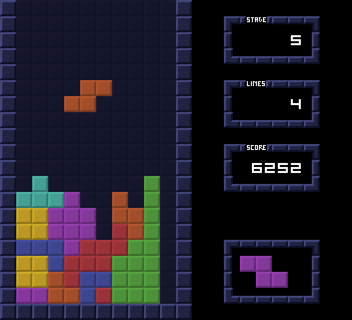

# Engine Evaluation

**Three engines being considered:**

- [Godot](https://godotengine.org/)
- [Nez](https://github.com/prime31/Nez)
- [HaxeFlixel](https://haxeflixel.com/)

**Simple Analysis:**

Godot:

| Pros                                     | Cons                                                                      |
| ---------------------------------------- | ------------------------------------------------------------------------- |
| Excellent community.                     | GDScript is loosely typed and not awesome.                                |
| Asset library.                           | Lots of magic strings.                                                    |
| Excellent editor.                        | C# as a second class citizen (maybe addressable with tools and code gen). |
| Can do the most out of the box.          | Limited resource management/loading exposure (not a lot of control).      |
| Most actively developed.                 |                                                                           |
| Easiest to create effects/shaders in.    |                                                                           |
| Flexible scene structure.                |                                                                           |
| Easy to create editor tools and plugins. |                                                                           |
| Most up to date rendering system.        |                                                                           |
| Highest fidelity pixel art rendering.    |                                                                           |
| Widest platform support.                 |                                                                           |
| Best 3d support.                         |                                                                           |

Nez:

| Pros                                   | Cons                                                                              |
| -------------------------------------- | --------------------------------------------------------------------------------- |
| C# as a first class citizen.           | Hardest to write effects and shaders in.                                          |
| Excellent entity and component system. | Smallest community.                                                               |
| Easy access to the C# ecosystem.       | MonoGame supporting libraries may require tweaking before they can work with Nez. |
| Pixel Art support.                     | Would require creating more things by hand.                                       |
| Battle tested (via monogame).          | Limited/rough 3d story.                                                           |
| Easiest to implement new features in.  |                                                                                   |
| .NET 6 support.                        |                                                                                   |

HaxeFlixel:

| Pros                                     | Cons                                 |
| ---------------------------------------- | ------------------------------------ |
| Battle tested.                           | Not C#                               |
| Great language (haxe).                   | Limited activity.                    |
| Simple structures to get up and running. | Limited third party library support. |
| Language is very geared towards games.   | No 3d story.                         |
| Geared strongly towards pixel art games. |                                      |

To give each a fair shake go through some tutorials with each one before going to the challenge.

**Test Tetris Challenge:**

Example image:

It doesn’t have to look exactly like this, but the spacing, window size, and block size should be derived from this; ie, blocks are 16x16 and the play field/window is 352x320.

UI Should not necessarily be styled the same between implementation.

Should have the following features:

Main menu:

- Play, Options, High scores, and Exit buttons.
  - Options
    - Turn sound effects on/off.
    - Turn music on/off.
    - Remap controls: rotate pieces left/right, drop piece faster, UI navigation and committing.
- High Scores will save the last 5 highest scores with a name and score and display them in a table like format.

Play mode:

- Pick pieces randomly with a preview of the next piece.
- 10 points per line cleared + 5 \* (number of lines cleared at once).
- Stage increments every 3 minutes where the default fall rate increases.
- Escape to pause.
- On game over check the player’s score and if in the top 5 ask for name and update the high score.

Pause Mode:

- Stop game play.
- Fade out music.
- Resume and exist menu options.

**Challenge Observations:**

Godot

Nez

- Nez UI is well featured but _quite_ buggy.
  - Cons
    - Hiding all tooltips crashes the app (fixed via [PR by me](https://github.com/prime31/Nez/pull/741)).
    - Disabled controls can still be activated with enter though the mouse will not trigger them.
    - Default skin does not identify disabled controls (may not be possible to identify them).
    - Focus identifying gets a little weird.
    - Limited/no animation support for UI.
  - Pros
    - Good skinning support.
    - Good tooltips.
    - Good control set and layout functionality.
- Very C#y, I could create pretty much whatever I could think of.
- Very accommodating.
- Code is pretty straightforward and well structured.
- Creating shaders requires going through the FX compilation process and using surprisingly low level APIs.
- Third party APIs use the monogame content pipeline (which sucks).

HaxeFlixel
